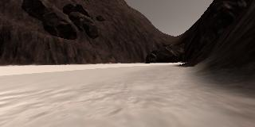
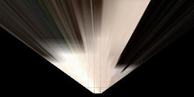
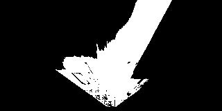
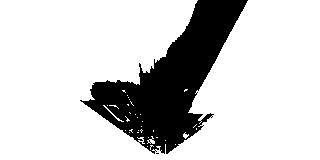

## Project: Search and Sample Return
### Writeup Template: You can use this file as a template for your writeup if you want to submit it as a markdown file, but feel free to use some other method and submit a pdf if you prefer.

---

**The goals / steps of this project are the following:**  

**Training / Calibration**  

* Download the simulator and take data in "Training Mode"
* Test out the functions in the Jupyter Notebook provided
* Add functions to detect obstacles and samples of interest (golden rocks)
* Fill in the `process_image()` function with the appropriate image processing steps (perspective transform, color threshold etc.) to get from raw images to a map.  The `output_image` you create in this step should demonstrate that your mapping pipeline works.
* Use `moviepy` to process the images in your saved dataset with the `process_image()` function.  Include the video you produce as part of your submission.

**Autonomous Navigation / Mapping**

* Fill in the `perception_step()` function within the `perception.py` script with the appropriate image processing functions to create a map and update `Rover()` data (similar to what you did with `process_image()` in the notebook). 
* Fill in the `decision_step()` function within the `decision.py` script with conditional statements that take into consideration the outputs of the `perception_step()` in deciding how to issue throttle, brake and steering commands. 
* Iterate on your perception and decision function until your rover does a reasonable (need to define metric) job of navigating and mapping.  

[//]: # (Image References)

[image1]: ./misc/rover_image.jpg
[image2]: ./calibration_images/example_grid1.jpg
[image3]: ./calibration_images/example_rock1.jpg 

## [Rubric Points](https://review.udacity.com/#!/rubrics/916/view)
### Here I will consider the rubric points individually and describe how I addressed each point in my implementation.  

---
### Writeup / README

#### 1. Provide a Writeup / README that includes all the rubric points and how you addressed each one.  You can submit your writeup as markdown or pdf.  

You're reading it!

### Notebook Analysis
#### 1. Run the functions provided in the notebook on test images (first with the test data provided, next on data you have recorded). Add/modify functions to allow for color selection of obstacles and rock samples.

The original image is as below: 
 
See section below for analysis of color selection.

#### 1. Populate the `process_image()` function with the appropriate analysis steps to map pixels identifying navigable terrain, obstacles and rock samples into a worldmap.  Run `process_image()` on your test data using the `moviepy` functions provided to create video output of your result. 

`Process_image()` is similar to `perception_step()`, see section below for `perception_step()` analysis.

### Autonomous Navigation and Mapping

#### 1. Fill in the `perception_step()` (at the bottom of the `perception.py` script) and `decision_step()` (in `decision.py`) functions in the autonomous mapping scripts and an explanation is provided in the writeup of how and why these functions were modified as they were.

#### 2. Launching in autonomous mode your rover can navigate and map autonomously.  Explain your results and how you might improve them in your writeup.  

**Note: running the simulator with different choices of resolution and graphics quality may produce different results, particularly on different machines!  Make a note of your simulator settings (resolution and graphics quality set on launch) and frames per second (FPS output to terminal by `drive_rover.py`) in your writeup when you submit the project so your reviewer can reproduce your results.**

#### Simulator Settings
Resoultion: 1280x1024 (Windowed) 
Graphics quality: Fantastic 
FPS: 6-8<b>

Here I'll talk about the approach I took, what techniques I used, what worked and why, where the pipeline might fail and how I might improve it if I were going to pursue this project further.  

#### Step-by-step walkthrough of `perception_step()`

#### Step 1: Perspective transform
First step is to do perspective transform so we can get a bird's eye view point of view of the camera's image. Getting bird's eye view POV is a crucial first step for our perception task of localization, mapping, and navigation.

Perspective transform settings: 
i) Four source points: 
`[14,140]` 
`[301,140]` 
`[200,96]` 
`[118,96]` 

ii) Destination points formula: 
`dst_size = 5`  
`bottom_offset = 6` 

destination = np.float32([[Rover.img.shape[1]/2 - dst_size, Rover.img.shape[0] - bottom_offset],
                      [Rover.img.shape[1]/2 + dst_size, Rover.img.shape[0] - bottom_offset],
                      [Rover.img.shape[1]/2 + dst_size, Rover.img.shape[0] - 2*dst_size - bottom_offset], 
                      [Rover.img.shape[1]/2 - dst_size, Rover.img.shape[0] - 2*dst_size - bottom_offset],
                      ])

Here is the result after perspective transform with the above setting is applied:

    
#### Step 2: Apply color threshold to identify navigable terrain, obstacles, and rock samples

I modified the color trashold function so that it can pick up a color channel within a minimum and maximum treshold. This is required in order to treshold rock samples & obstacles from the image. Note that I used color picker in photoshop in order to gauge each RGB channel's range of color for the rock sample & obstacle. Below are my final respective settings for each color treshold applications:

i) Navigable terrain 
Min Treshold: 160, 160, 160 
Max Treshold: 255, 255, 255 

ii) Obstacles 
Min Treshold: 0, 0, 0 
Max Treshold: 159, 159, 159 

iii) Rock samples 
Min Treshold: 100, 100, 0 
Max Treshold: 200, 200, 60 

#### Step 3: Update Rover.vision_image (this will be displayed on left side of screen) 

See the code, very straightforward.

#### Step 4: Convert map image pixel values to rover-centric coords

This step is done by calculating pixel positions with reference to the rover position being at the center bottom of the image.

This step is done so that we can understand the image with respect to the rover's coordinate, which will allow us to navigate later on  

#### Step 5:  Convert rover-centric pixel values to world coordinates     

This step allows us to localize ourselves with respect to the ground truth map, which is a crucial step in our perception task.

Involve rotation according to the rover's yaw angle and translation according to the rover's position vector.
           
#### Step 6: Update Rover worldmap (to be displayed on right side of screen)
The rover's worldmap convention for this project is red channel (0) for obstacle and Blue channel (2) for navigable terrain.
    Rover.worldmap[y_pix_obs_world, x_pix_obs_world, 0] += 255
    Rover.worldmap[y_pix_obs_world, x_pix_obs_world, 2] -= 255    
    Rover.worldmap[y_pix_world, x_pix_world, 2] += 255
    Rover.worldmap[y_pix_world, x_pix_world, 0] -= 255

The Green channel (1) is used for the rock sample marking and I added +1 to the world map's channel 1 for rock's world pixels as the drive rover function only check for binary (0 or 1) for the rock's pixel marking: 

    Rover.worldmap[y_pix_rock_world, x_pix_rock_world, 1] += 1

#### Step7: Convert rover-centric pixel positions to polar coordinates
Crucial to get the angle of steer
    rover_dist, rover_angles = to_polar_coords(xpix, ypix)
    rock_dist, rock_angles = to_polar_coords(xpix_rock, ypix_rock)

#### Where the pipeline might fail.
1. Terrain, obstacle and rocks of varying color than the one in the simulator - We are relying on color treshold to pick out navigable terrain, obstacle, and rock sample, thus if the rock sample is of similar color to the obstacle then the rover won't be able to spot it. Same goes for navigable terrain, if the sand/soil of the terrain is darker and fall within range of the color of the mountains, the pipeline will breakdown.
2. If there are small rocks in front of the rover, the rover won't be able to evade them due to the simplistic maximum treshold of sum of navigable terrains for stopping decision algorithm that I used
3. The rover might go in circle and explore only certain parts of the map, this is due to the simplistic random +15/-15 from mean average navigable terrain steering co-efficient when going forward. There was no path planning capability at all.
4. Terrain with steep gradient, either downhill or uphill - Terrain with steep gradient will pose a problem to the pipeline, as the warp transformation we are doing is making an assumption that the land is flat. So if the land is not flat, than the mapping localization might go wrong and the judgement of distant from the rover's polar co-ordinate will also be wrong, thus causing lots of problem for the rover's navigation and sample return.

#### How I might improve it?
1. Change color treshold to image segmentation deep neural network in order to identify navigable terrain, obstacle, and rock sample. Image segmentation neural network will allow more complex features to be detected other than just color tresholding, and better still we don't have to hand-craft the features, the neural network will learn by itself; the only downside is a deep neural network will require a lot of data for it to be able to be trained properly, although we might be able to laverage on transfer learning in order to mitigate that.
2. The better method is to sum navigable terrains that are only above certain amount of distance in polar coordinate or certain y+ pixels in normal coordinate, as a rock in front of the rover will drastically reduce the navigable terrain in the distance (think of it as it blocks the horizon of navigable terrain).
3. Use a path planning algorithm like A* that will systematically plan to navigate unchartered navigable terrain.
4. Firstly the rover should have a gyroscope so that not only we know the yaw angle of the rover, we also need to know the verticle degree of the rover. Secondly we need a depth sensing sensors, maybe a stereo camera, or sonar, or lidar, so we can judge depth and able to map out if the terrain is curving up or down. 
